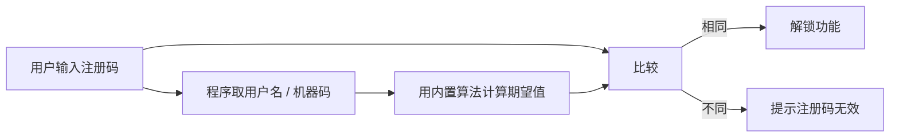
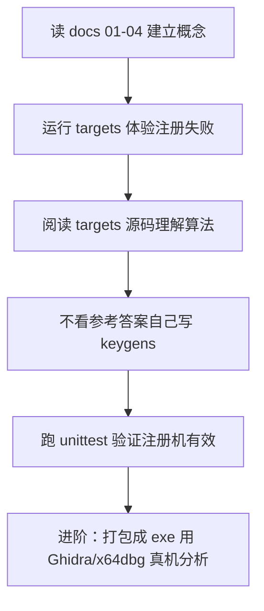

# 01 · 认识注册机（Keygen）

## 1. 为什么软件需要注册码

商业软件通常采用「先试用、后付费」的模式：免费版有限制（功能缺失 / 使用次数 / 水印），
付费后由软件作者提供一个**注册码**，输入后解锁完整功能。

为了防止用户之间互相传播注册码，作者一般会把注册码与**用户名**或**机器特征**绑定，
让每个注册码只对一个人或一台机器有效。

## 2. 注册验证的基本流程

无论实现多复杂，本地注册验证的本质都是下面几步：

注册机要做的事就是：**还原出第 C 步的算法，自己算出能通过 D 的注册码**。

## 3. 注册机有哪些类型

| 类型 | 原理 | 优点 | 缺点 |
|------|------|------|------|
| 内存注册机 | 运行时把内存中「比较结果」改成通过 | 无需还原算法 | 每次版本更新都要重做 |
| 算法注册机 | 还原验证算法，直接生成合法注册码 | 一劳永逸、最接近"注册机"定义 | 需要把算法逆出来 |
| 补丁（Patch） | 直接修改程序指令，跳过验证 | 最快 | 属于破解而不是注册机 |

本仓库重点教你**算法注册机**：理解验证算法 → 用 Python 复现 → 生成注册码。

## 4. 学习路线

新手常见误区：

- 以为注册机就是"随便填个码"——错，注册码必须通过程序验证。
- 以为算法很神秘——其实大多由字符串比较、哈希、异或、简单数学组成。
- 以为注册机只有一种写法——根据验证算法不同，写法千差万别。
