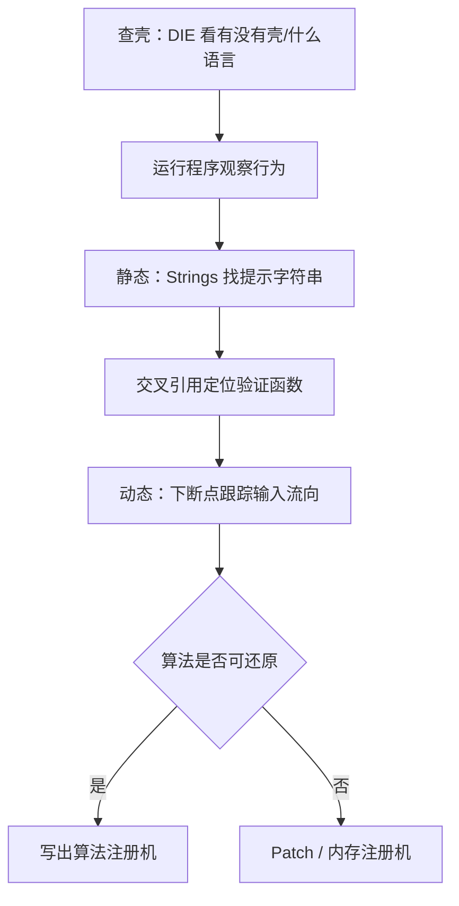

# 04 · 实战分析方法

完整分析一个未知程序的套路（以 Windows 原生程序为例）。

## 1. 完整流程



## 2. 定位验证函数的常用断点

输入注册码点「确定」后，程序必然要：

1. **读取你的输入**：Win32 里常见 `GetDlgItemTextA/W`、`GetWindowTextA/W`。
   断在这里，F8 单步往下，就能找到谁在"消费"这个字符串。
2. **比较**：`strcmp / lstrcmp / wcscmp`、`memcmp`，或内联的手写比较循环。
   断在比较处，看两个操作数，正确注册码可能就在寄存器或栈里。
3. **弹出结果**：`MessageBoxA/W` 上断点，往回看是谁调用的。

## 3. 两种典型手法

### 内存注册机（简单粗暴）

- 在比较指令（如 `CMP EAX, EBX` / `TEST`）后把标志位改成相等，
  或直接把跳转改成 `JMP` 跳过失败分支。
- 适合：只想"能用"，不在乎算法。
- 缺点：程序一更新补丁就失效。

### 算法注册机（还原算法）

- 通过反汇编/反编译读懂验证函数，用 Python/C 复现同款算法。
- 关键点：注册机只需**产生能通过验证的输入**，不一定要和作者算法一模一样。
  例如程序算 `hash(username)` 和输入比较，你的注册机算同样的 `hash(username)` 即可。

## 4. 真实世界的坑

- **加壳/混淆**：先脱壳，或直接带壳动态调试。
- **反调试**：`IsDebuggerPresent`、时间差检测。x64dbg 有 ScyllaHide 插件绕过。
- **字符串加密**：提示字符串不可见，改用 API 断点定位。
- **校验完整性**：修改文件后程序拒绝运行（校验和/签名校验）。
- **服务器验证**：本地算法再对也白搭，需要分析网络协议。

## 5. 进阶建议：用 C 写一个练手目标

PyInstaller 打包的程序逆向体验和原生 C 程序差别很大。学会基本流程后，
建议在自己电脑上装一个 MinGW-w64（提供 gcc），编译下面这种经典目标：

```c
// demo.c —— 自己编译，自己逆向
#include <stdio.h>
#include <string.h>

int main(void) {
    char input[64];
    printf("Serial: ");
    scanf("%63s", input);
    if (strcmp(input, "SECRET-42") == 0)
        printf("Registered!\n");
    else
        printf("Invalid.\n");
    return 0;
}
```

编译：`gcc -O0 demo.c -o demo.exe`，然后用 x64dbg / Ghidra 分析，
会发现和 `targets/easy/` 一模一样的逻辑，只是从汇编里认出来。

## 6. 学习资料推荐

- 《加密与解密》（第4版）——中文逆向经典教材
- CrackMe 练习网站（如 crackmes.one）——大量合法练手目标
- x64dbg 官方文档 / Ghidra 官方教程
